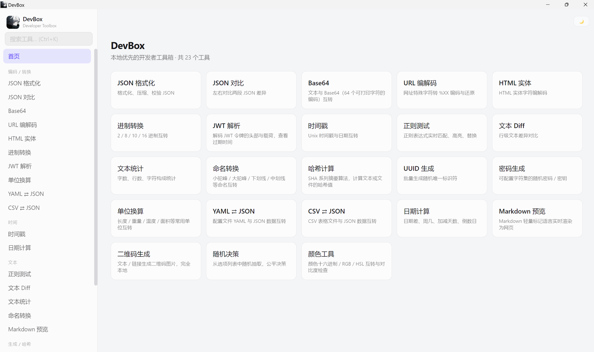
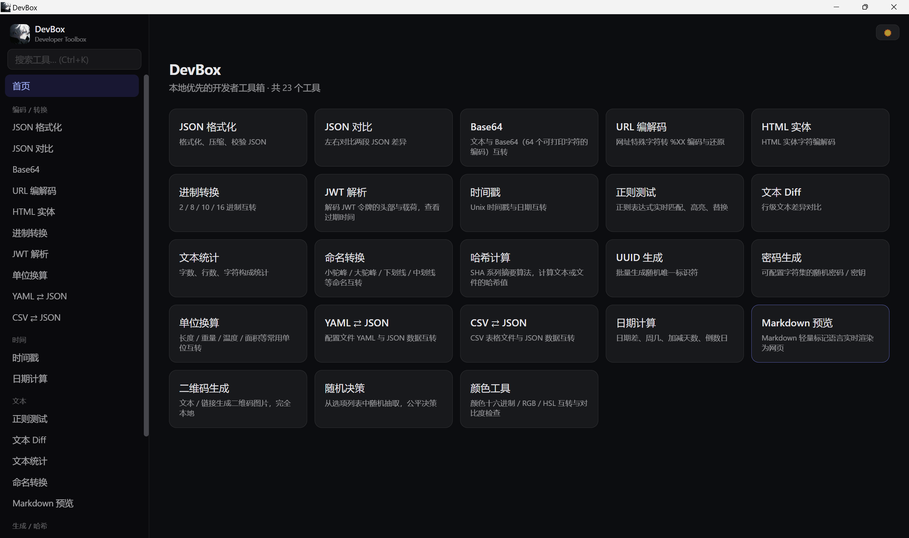
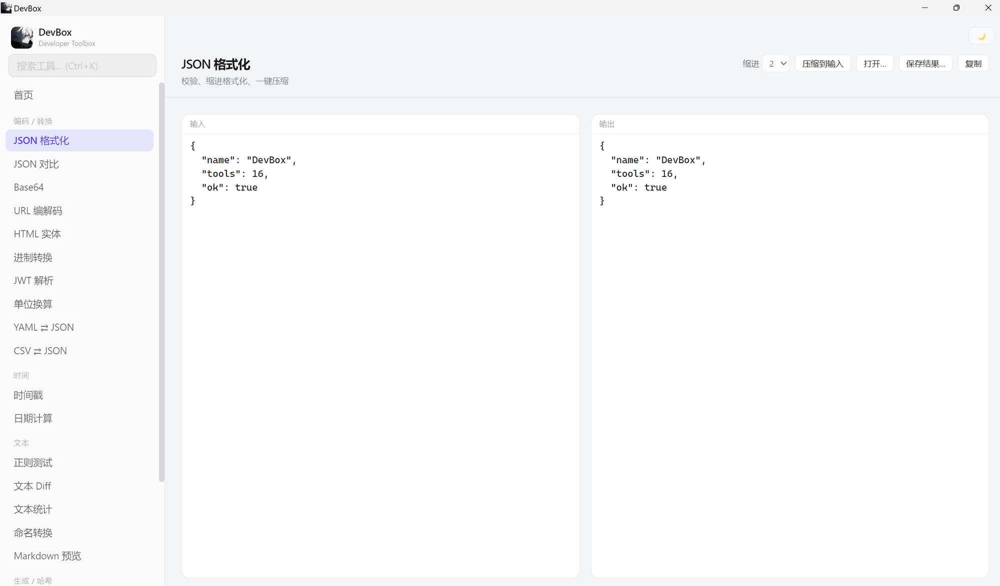
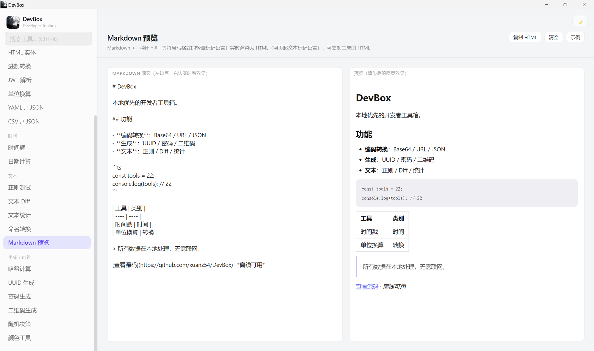
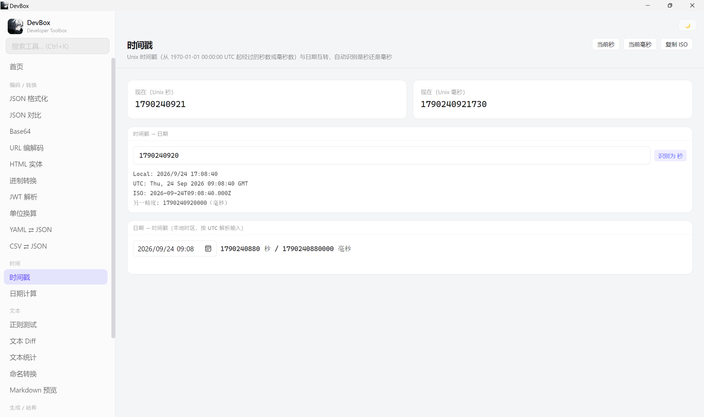
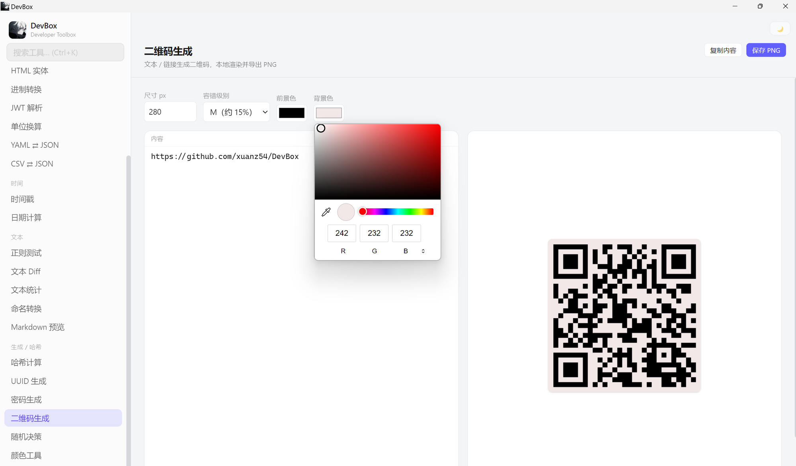
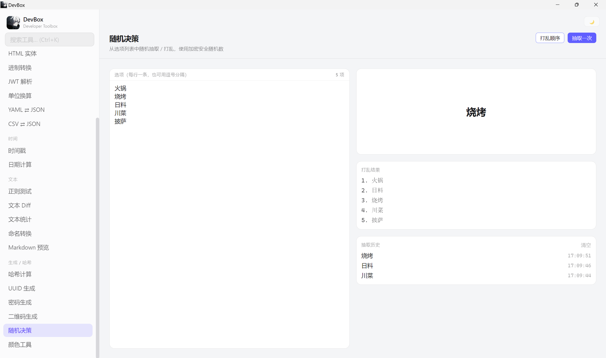

# DevBox

本地优先的开发者工具箱（桌面绿色单文件 exe）。基于 **Neutralino.js + React + Vite + Tailwind CSS**，所有数据本地处理，无需联网。

## 直接使用

从 [GitHub Releases](https://github.com/xuanz54/DevBox/releases) 下载 `DevBox-win_x64.exe`，双击运行。

- **系统要求**：Windows 10/11 **x64**；需 WebView2 运行时（Win11 自带，部分 Win10 需安装一次）
- 免安装、单文件；不依赖 Node.js 或源码
- 仓库内 `dist/` 不提交 exe，**请通过 Release 获取**

## 界面预览

### 首页（亮色）



打开即见全部工具：左侧按分类导航，右侧为卡片入口；顶部搜索框支持 **Ctrl+K** 全局搜索，右上角可切换亮/暗主题。

### 首页（暗色）



同一套导航与卡片，一键切换暗色主题，适合夜间使用。

### JSON 格式化



左栏粘贴原始 JSON，右栏实时美化/压缩结果；可校验格式、调整缩进，并一键复制或保存输出。

### Markdown 预览



左边写 Markdown 源文，右边实时渲染为网页效果；支持标题、列表、代码块、表格等，可一键复制生成的 HTML。

### 时间戳



Unix 时间戳（秒/毫秒）与日期互转：展示当前时间戳，支持时间戳→本地/UTC/ISO、日期→时间戳，并自动识别秒或毫秒。

### 二维码生成



文本或链接本地生成二维码：可调尺寸、容错级别、前景/背景色，预览后一键保存 PNG。

### 随机决策



每行一个选项（或逗号分隔），支持「抽取一次」与「打乱顺序」；使用加密安全随机数，并记录抽取历史。

## 功能（23）

| 分类 | 工具 |
|---|---|
| 编码/转换 | JSON 格式化、JSON 对比、Base64、URL 编解码、HTML 实体、进制转换、JWT 解析、单位换算、YAML ⇄ JSON、CSV ⇄ JSON |
| 时间 | 时间戳、日期计算 |
| 文本 | 正则测试、文本 Diff、文本统计、命名转换、Markdown 预览 |
| 生成/哈希 | 哈希计算、UUID、密码生成、二维码生成、随机决策、颜色工具 |

其他：全局搜索（Ctrl+K）、亮暗主题、剪贴板/文件打开保存（桌面端原生对话框）。界面文案以中文为主，专有名词均附中文解释。

## 环境要求（开发）

- Node.js 20+
- Neutralino CLI：`npm i -g @neutralinojs/neu`（或 `npx @neutralinojs/neu`）
- Windows 上需 WebView2 运行时

## 从克隆到跑起来

```bash
git clone https://github.com/xuanz54/DevBox.git
cd DevBox
npm install
npm run dev        # 浏览器调试 UI（不加载原生 API）
neu run            # 桌面窗口 + Vite HMR（首次会下载 bin/ 运行时）
```

说明：`/bin` 与 `/dist` 不在 Git 中；`neu run` 首次会自动拉取对应平台二进制。

### 日常命令

```bash
npm run typecheck  # tsc --noEmit
npm test           # vitest（仅测 core 纯函数）
npm run build      # 前端产物写入 resources/
neu run            # 开发窗口
```

## 添加自定义工具

以 `base64` 为模板，三步完成注册（**不必改** `App.tsx` 路由）：

1. **`src/tools/<id>/core.ts`** — 纯逻辑，返回 `Result`（`src/lib/result.ts` 的 `ok` / `err`）
2. **`src/tools/<id>/Tool.tsx`** — `export default` 组件，用 `src/components/ui.tsx` 的 `ToolPage`、`Pane`、`btn` 等
3. （推荐）**`src/tools/<id>/core.test.ts`** — vitest 测 `core` 导出的纯函数

注册两处：

```ts
// src/tools/registry.ts → tools 数组追加
{
  id: 'my-tool',
  path: '/my-tool',
  name: '我的工具',
  desc: '一句话说明',
  category: 'encode', // encode | time | text | gen
  keywords: ['my', '工具'],
}

// src/tools/components.ts → import + toolComponents
'my-tool': MyTool,
```

首页卡片、侧边栏、Ctrl+K 搜索会随 `registry` 自动出现；未挂组件时路由显示占位页。

## 其他定制

| 项 | 位置 |
|---|---|
| 应用图标 / 任务栏 | `resources/icons/appIcon.png`、`resources/favicon.ico`、`src/icons/logo.png` |
| 窗口尺寸 / 标题 | `neutralino.config.json` → `modes.window` |
| 原生 API 白名单 | `neutralino.config.json` → `nativeAllowList` |
| 主题 | `src/stores/theme.ts` |
| Windows 文件属性 | 根节点 `applicationName` / `description` / `author` / `copyright` / `applicationIcon` |

## 打包绿色 exe

```bash
# 打包前先结束已运行的 DevBox-win_x64，避免文件占用
neu build --embed-resources --release
```

产物：`dist/DevBox/DevBox-win_x64.exe`（资源已内嵌，单文件）。  
`/dist` 已在 `.gitignore`，**不要**把 exe 提交进仓库。

## 发布 GitHub Release

用户侧只认 Release 下载（见上文「直接使用」）。

**网页（推荐首次）：**

1. 打开仓库 → **Releases** → **Create a new release**
2. **Tag**：`v1.0.0`（与 `package.json` / config 的 `version` 一致；Target 选 `main`）
3. **Release title**：如 `v1.0.0`
4. **Release notes**：写清改动；可点 Generate release notes
5. 把 `dist/DevBox/DevBox-win_x64.exe` 拖到附件区
6. Publish release

**命令行（可选）：**

```bash
git tag v1.0.0
git push origin v1.0.0
gh release create v1.0.0 dist/DevBox/DevBox-win_x64.exe \
  --title "v1.0.0" \
  --notes "首个正式版本"
```

每次发新版本：改 `version` → 打包 → 新 tag → 新 Release 上传 exe。

## 目录结构

```
src/
  components/     # 通用 UI（复制、面板、文件/剪贴板）
  lib/            # Result 等基础类型
  stores/         # zustand（主题）
  tools/          # 每个工具：core.ts（纯逻辑+可测）+ Tool.tsx（UI）
resources/        # Neutralino 资源（Vite 构建输出 + 图标 + client）
docs/screenshots/ # README 用应用截图
neutralino.config.json
```

## 约定

- 纯逻辑与 UI 分离，单测只测 core 导出的纯函数
- 界面文案用中文，英文专有名词需附中文名称或解释
- 无 Webhook / 无云同步 / 无账号；数据全在本地
